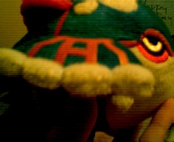
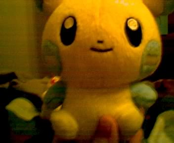
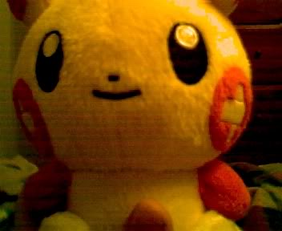
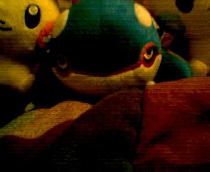
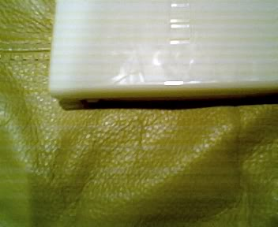

####General
The Talking site... IT'S COMING!!! Now that I have a microphone, I'm going to have the site TALK TO YOU!!!! I'm 99% Sure it will get on your nerves! Sorry about Skipping an update, it's just that the Pokemon tournament was Crazy! There was so much to do, with so lot of lines! The line for Celebi and the top twenty was out the mall! (well not really). But, it got so long, that at 2:00 they closed it because the line was 3 hours long, and the tournament was only until 5:00! I don't think it was worth it. It was kinda scary, seeing all these old people there. I'm pretty sure their Imagination should've died around 18 years, but oh well! Justin lost first round from some kid who used an electrode with a Kyogre and Protect. I knew I should've taught two of his pokemon Protect! He still got a Pokemon Keychain though. Anyway, check the PC Downloads for more.

####Video Games
THIS UPDATE IS STILL UNDER CONSTRUCTION PLEASE CHECK BACK LATER

####Computer Programming /  Pokemon Tournament!!!!  
Ok, sorry *again* but the PC Section isn't gone it's just.... missing.... But, using the Digital Camera, I've got a load of photos here from the tournament, I mean from my Birthday gifts. The Shutter on my camera was closed the whole time! So, I just took the after photos. You can get 'em below. There's some good stuff there! Well, If you really want to go into Computer Programming, to train for the TCG part of the tournament, I was working on a program with game maker. It's kinda pointless now, plus, it's only half complete. Maybe if I get a chance to finish it, I'll put it here for download. It's very simple. The Opponent PC starts off as a Yoshi and only does 50 damage each turn and has 70 HP. When it's your turn. You can choose Add 10 Damage or next Turn. It's kindof basic and behind the scenes. If I ever feel like it, I might make it cooler looking for real use. Meanwhile Project2 has been corrupted. I'm working on recovering it. I'll probably be back to work on it soon. That's it. Be sure to check out the Pics of the stuff. (the Kyogre Pokedoll looks like a Jellybean!!!) That's all folks!!!!

####Downloads
The Picture Album - Pokemon Palooza
Birthday Pictures!

Here's a Pic of my Kyogre Pokedoll. It was $9.95 I got it cause it looked pretty awesome!!!

002.jpg Here it is up close. You can see it's shaped like a Jellybean!!!

This is my Sister's Minun Doll (minus the hand of course!)

This is believe it or not, my Mom's Pokedoll. She picked Plusle just to match Minun I believe.

Here they all are together. Plusle and Minun got cut off, cause Kyogre's way cooler!

This is my DS Lite. It's an early B-day gift. I say it's quite, oh, how would kid's say it these days? "Awesome" Yes, quite "Awesome" Indeed!

**_SEE YA!!! MOOSE OUT!!!_**
