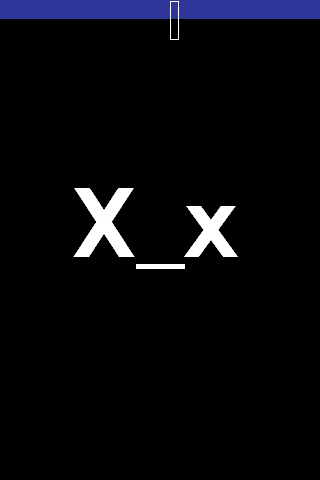

This is a lovely little application for the iPod or iPhone that allows you to pretend it's not working. The way it works is, it creates a virtual environment that the user can't close with the Home button. This environment also blocks the use of the device and displays and image, that image being the UnderScore logo of (x_X).

It's a nice little application that may come in handy every once in a while. Like, if some ugly kid wants to go on safari, simply launch UnderScore, and he can't use it. How do you get out of UnderScore? Well, there's a secret button hidden in a 10x40 slice of the screen which you need to tap to exit the app. There are other methods of exiting it as well, such as holding down both Home and Sleep/Wake for a while to force a reboot, or wirelessly sending it a kill command over SSH.

Now, onto the technical stuff, in order for the app to be persistent, you need to launch the app, then exit it with the Home button. Once you exit it, it will pop back up and be unexitable. Instead of hitting the home button, you can also turn it upside down to reveal the *hard to hit* secret button. In the persistent mode, however, the secret button will NOT be revealed by turning it upsidedown, so you have to be careful that you know where it is. You can see it clearly in this picture, where the blue represents the status bar, and the box represents the button:

Kapeesh? I think that's about it. You can download the app [>>here](http://www.ipodtouchfans.com/forums/attachment.php?attachmentid=21576&d=1212611396), or for head to [ipodtouchfans](http://www.ipodtouchfans.com/forums/showthread.php?t=69275) for further documentation. If there's anyone at all out there who could put this on an Installer source PLEASE DO!!