Visual Boy Advance is one of the most essential utilities in your Pokemon Emulation Tool belt. Well, not really, but without it there’d pretty much be nothing.

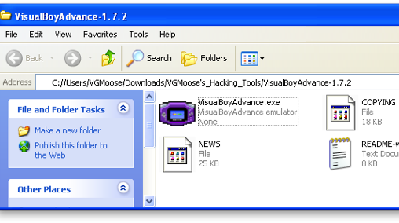

So first thing’s first, open VBA in the VisualBoyAdvance folder in the Hacking Tools download of this site. Alternatively, you can get it here. Once it’s open, check out the minimalist interface:

Well, I mean like, what were you expecting? Obviously you’ll spend most of your time messing around with the File, Option, Cheats, etc. thingies. Now let’s get started loading a ROM. Preferably one of your own, but hey, I won’t judge. Whatwhosaidthat? Anyway, click File, then Open. Alternatively, hold down ctrl and press O.

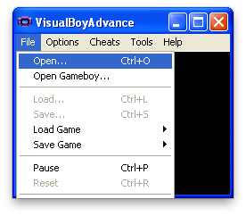

After this, select where you have your ROM saved. It can be either in .BIN, .GBA format, or .ZIP format. Make sure it’s on a drive that you have write access to as well, for more reasons than just saving that will be covered later on.

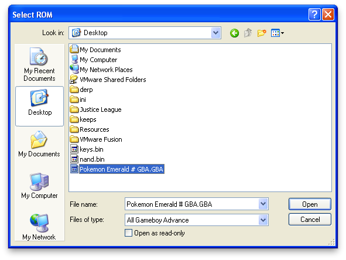

Once the ROM is loaded, you are presented with an extremely welcome screen. It should look exactly how it looked/looks on your actual Game Boy.

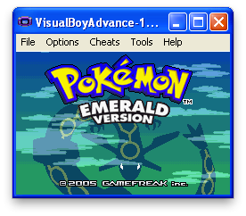

Here are the default controls for Visual Boy Advance. They can be changed at any time by going to Options > Joypad > Configure > 1...

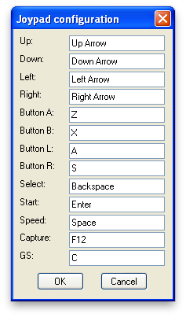

There’s really nothing more to it. I personally just use the default control scheme because there’s nothing wrong with it. There are some other basic things that you should know about VBA before diving into actual ROM hacks. The first of these things you should know, are called Save States.

A Save State does exactly what it sounds like it does, which is saves your current state in the game. If you wanna get technical, it saves the RAM of the Game Boy to a file and allows you to resume at a later date, much like the Hibernation mode that of a modern day laptop. Anyway, using Save States is rather straightforward:

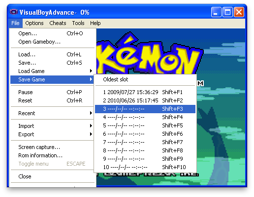
 
Clicking on Slot 3 in this example would write a new save state to slot 3. If I chose 1 or 2, I’d be overwriting the save states in them already. I would highly recommend using Save States over the built save feature, as not only is it more reliable, but it is also faster and more precise. To load a save state, you would obviously do just that:

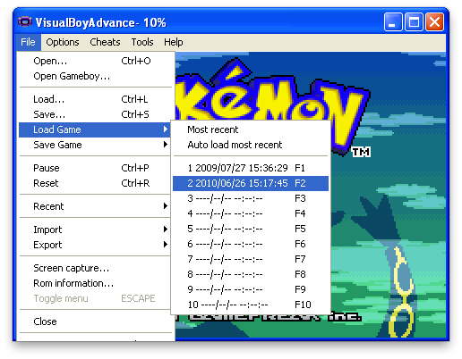

Looks similar, right? Well let’s see what happens when we load it:

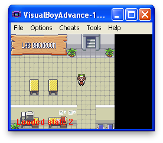

Just as expected, here we is where I made my save state earlier. Please keep in mind that every time you edit a ROM, simply reloading a save state isn’t enough to append the changes that you made. You must instead go to File > Open each time.

Another cool VBA trick is the “Speed” feature. Since we’re playing on a much more powerful machine than an actual Game Boy, it makes sense that we should be able to play it at breakneck speeds, right? Try holding down the Space button (or whatever button you may have set it to) and see what happens.

There’s not really a picture for this, but it’s pretty much self explanatory. Hold space, go fast. Release space, go regular speed.

Now, as for recording your fabulous hacks. Before we start recording however, I would suggest you set the text speed to FAST. It gets boring if you don’t!

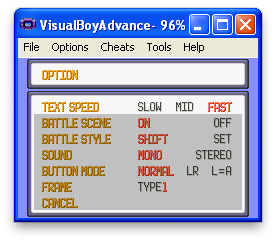

Now, as for the actual recording, everything you need is under the Tools menu. Click on Tools > Record... > Start AVI Recording:

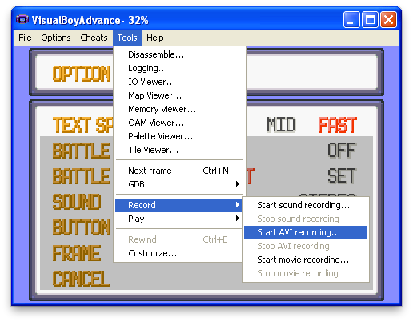

Almost as soon as you press Start, you wil be presented with a Save As dialog. 

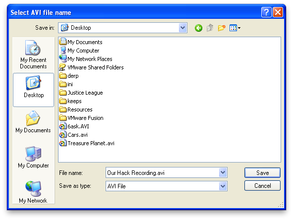

In this simply type in the name as you would in any other Windows application and press Save. A new dialog box will appear. Set it to Uncompressed if it isn’t already set, and click OK.

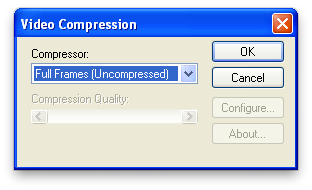
 
NOTE: Click OK, don’t press Enter. In most cases, pressing Enter will press the Start button in the game and the Menu will annoyingly pop up immediately while you’re recording.

Congratulations! You’re now recording! Here are some tips:
1)Make sure the viewer will have enough time to read whatever text is on screen. I usually read it quickly in my head twice before pressing “Z”
2)Ensure that your recording isn’t too long. It will waste RAM on your computer, and the audio might slowly desync if you record for more than like five minutes.
3)When you mouse out of the window (if you do not have it set to continue playing) the recording will pause as well and pickup seamlessly where you left it off.
4)DO NOT EVER USE THE SPEED UP FEATURE WHILE YOU ARE RECORDING. I can’t stress this enough. It’s the number one issue I have when I watch other hack vids. You’re recording Full Frames, so when you “speed up,” the game doesn’t. Your viewer is then forced to watch an extremely slow version of what you thought was “fast.”

To stop recording, simply reverse the process that we did a few steps ago:

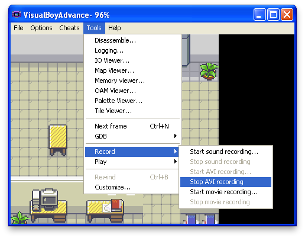

Voila! You now have a cute little .AVI file that can go straight to youtube or into your favorite movie editor.

We’re almost done here, just one more thing to go over. Cheats. VBA supports “Action Replay” (Codebreaker) cheats, as well as GameShark Advanced ones. It also has a custom Code system that you might see around the web. To check out the cheats go to Cheats > Cheat List...

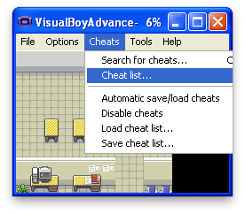

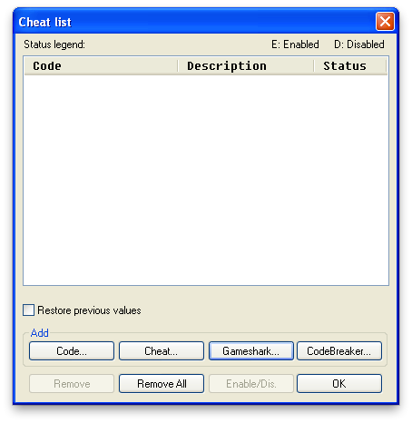

This is almost entirely self-explanatory by this point, but I’ll run you through it quickly so that you get an understanding. Sometimes you may need a cheat such as “Have all Gym Badges” in order to get Pokémon with HMs to obey you for demonstrative purposes. To do this, search around, for either Action Replay or Gameshark codes for your specific games.

Here’s an example for Action Replay and Pokémon Emerald to give the player all the different types of Poké Balls: 085938bb99ff313d2dafd7395d796510. Since it’s Action Replay, click “CodeBreaker...” in the screenshot above and fill in the information in the pop up window.

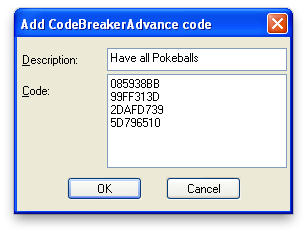

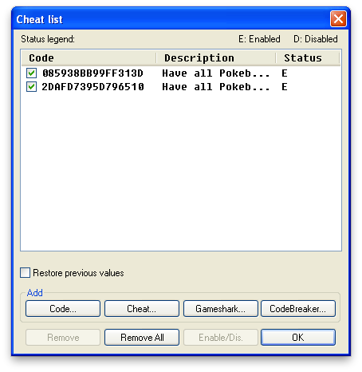

As you can see, the Cheats are enabled. Click okay and check to see if they worked in the game.

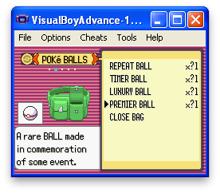

Yep! It’s a success! Utilize cheats to manipulate small things that you may need for the purposes of demonstrating your actual hacks. Cheats will save/load along with Save States, so make sure to manage them accordingly.

And that pretty much concludes this first tutorial! It went awfully in depth (A screen shot for practically every little step). The other tutorials won’t be as childish. But come on, you gotta get the basics down!

Things to Remember:
1)ROMs must be reloaded if they are edited
2)Save states are important and preferred to regular saving
3)You can hold down “Space” to accelerate gameplay
4)Do not speed up while recording
5)Cheat lists save with save states

And that’s it! Feel free to shoot me an email at vgmoose@gmail.com if you have any further questions!