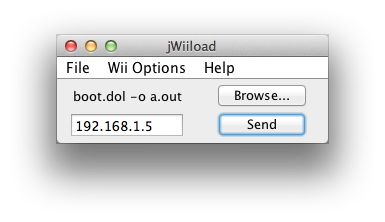
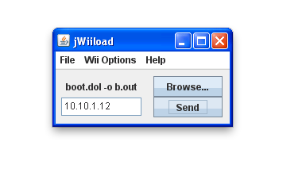

**JWiiload** is an program that sends bootable ELF and DOL files to a Wii that is currently running the Homebrew Channel mod. It sends the file over the network, so code can easily be compiled for the Wii, and then run by using it from the console.




JWiiload is programmed in Java so that it is compatible on any OS that can run the Java Runtime. Unlike many other Wiiload programs with graphical interfaces, JWiiload does not rely on any pre-built binaries, and runs everything from Java natively.

####Requirements

- Java Runtime Environment (JRE)
- Be on the same network as your Wii
- Linux, Mac, or Windows machine

####Usage

Double click the program, and if you have the JRE installed, it should just launch. First, it will ask for a file if the auto-send is on (by default) and then try to automatically find the Wii behind the scenes. If it can’t locate it, which it often cannot, enter the IP address and hit send. There are preferences to specify arguments and a specific port, and also to disable the autosend feature. When autosend is disabled, it will not prompt the user at launch for a file.

To use it from the command line, run it as you normally would a .jar file, and pass it the necessary arguments. Passing any arguments at all will not launch the GUI, and keep it contained in the command line only.

```
java -jar JWiiload.jar 
```
  
pass $WIILOAD (*nix) or %WIILOAD% (win) as the first argument if your environment is set up that way. (Accepts “tcp:x.x.x.x” or just “x.x.x.x” to ensure compatibility with Wiiload.)

pass “AUTO” as the first argument to try to automatically find the Wii.

pass “PREV” as the first argument to use the last known Wii IP that worked.

For more information, see the [WiiBrew page](http://wiibrew.org/wiki/JWiiload) on JWiiload

The project’s source code is all available at [GitHub](https://github.com/vgmoose/JWiiLoad), and older changes can be tracked on [Google Code](http://code.google.com/p/jwiiload/).

