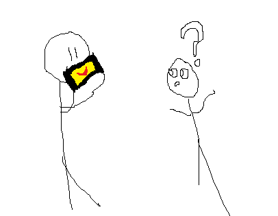

Mario Face is an application that is based off a funny mini-game in [Mario Party Advanced](http://www.mariowiki.com/Mario_Party_Advance). In the application, the entire phone’s screen fills with the face of one of multiple Mario characters– Mario, Peach, Goomba, or Boo. Once this is done, you simply hold the phone up to your face (screen facing away from you), and then press the volume buttons or tap the screen to make it appear as if you are talking with that character’s mouth.

[Download APK file here](Mario Faces.apk)

To put it less elegantly:

The app itself actually has an extensive history. As it is a rather straightforward application to create, I often create it as one of my first applications on a device. It was first posted about on [June 4th, 2008](http://www.ifans.com/forums/threads/mario-party-advance-gaddget-port-lipsync.71797/), and was coded with the Jiggy runtime, a JavaScript runtime for jailbroken iOS.

It was re-released as [LipSync for Android in Flash](http://lipsync.rickyayoub.com/) and [LipSync](http://lipsync.rickyayoub.com/iphone/) for iPhone in Javascript (as a web app).

The latest release was the Android native application, Mario Face. Mario Face received 40,000+ downloads, and still has 2,000 active users. Unfortunately, the application was only online in the market for a month, before Nintendo removed it for copyright infringement. Although I believe that it is covered by fair-use, I will only be hosting it online here from now on.