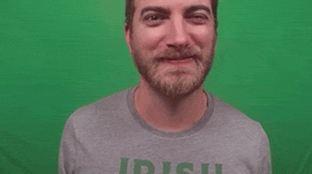
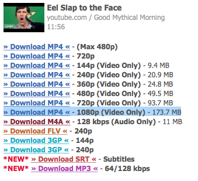
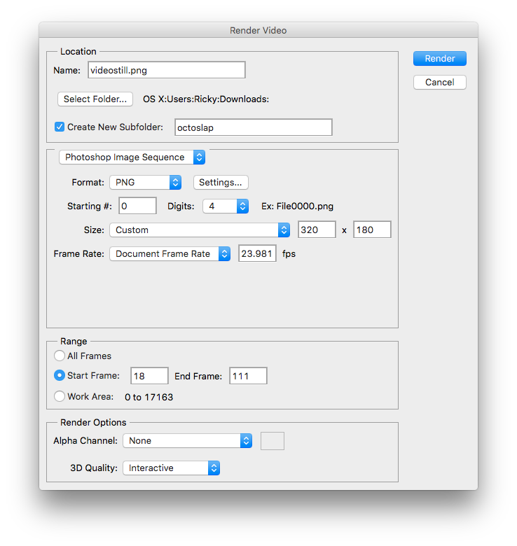
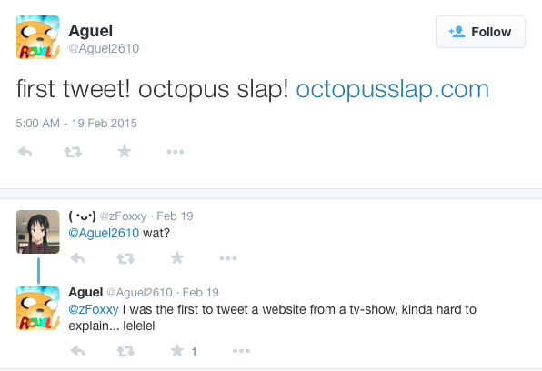

So I'd like to take this blog entry to talk about something that I made a few days ago. Well, at this point it's more like a few months ago. 

[OctopusSlap.com](http://octopusslap.com) was made on February 19th 2015, and it was created using stills from this [YouTube video](https://youtu.be/JJiKP1wkR6Q?t=404) by [Rhett and Link](https://www.youtube.com/rhettandlink2).



## Introduction
I happened to catch the Good Mythical Morning episode early, about a half hour after it went up. During the video, Rhett and Link parody the existing [EelSlap.com](http://eelslap.com), with an octopus instead. Before being slapped, Rhett exclaims "You've heard of EelSlap.com... But have you heard of OctopusSlap.com?" 

I hope I'm not making this more dramatic than it actually is, but I'm the type of person who tries to visit URLs that are offhandedly mentioned in videos and stuff. Usually, someone else has already registered them. In this case, however, the domain OctopusSlap.com was available!

Now you have to understand, this NEVER happens. The opportunity was too perfect– Additionally, my friend [Chris](http://cciollaro.github.io) has previously owned the domain [Octopus8.cc](http://octopus8.cc), and I've hosted stuff there before, so the concept of octopus-based domains was not entirely foreign to me.

I already have one domain registered with [Godaddy](http://godaddy.com), so I registered OctopusSlap.com with them as well. Incidentally, Rhett and Link actually plug GoDaddy as a sponsor in their next week's video.

## The Process
After buying the domain, I knew I had to work quickly to get my parody site up and running. Most people watch the show on a daily basis, so the sooner it was up the more people I'd potentially reach. 

Here are the tools I used to effectively parody it:
- wget
- [KeepVid](http://keepvid.com)
- QuickTime
- PhotoShop 
- Imagemagick
- Preview

Downloading and mirroring the Eelslap site is easy with wget. The following command will save the entire site and all referenced images/scripts to a folder named "eelslap.com":
```
wget -mk http://eelslap.com
```

Once the site was downloaded, I replaced all instances of the word "Eel" with "Octopus". I removed the Facebook button, but left the Twitter one. Now I needed to download the actual video to begin working with it.



Downloading the source video was made very easy with Keepvid.com. It gives you download URLs directly from Google's servers, and I didn't need audio, so it works out that they were separate.

With the video downloaded, I opened it in Quicktime Player, and chose Edit -> Trim. This works similarly to trimming a video on an iPhone. I isolated just Rhett's octopus slap, and trimmed the video. I thought about doing Link's eel slap as well, however the eel really didn't enter the frame enough to feel good to control with the mouse.

Now it was time to look into how the Eelslap.com site itself was made.

[](http://eelslap.com/images/eelslap_site_panorama1.jpg)
[](http://eelslap.com/images/eelslap_site_panorama2.jpg)
[](http://eelslap.com/images/eelslap_site_panorama3.jpg)
[](http://eelslap.com/images/eelslap_site_panorama4.jpg)

The magic is revealed to be Javascript that cuts up images that are long strips of video stills and shows them before the user as their mouse moves over the image. The four images are pictured above. Click them to see the enlarged versions.

I don't feel particularly good about completely stealing the code behind Eelslap, however, as it is parody, this is the best way to ensure OctopusSlap.com would be as similar as possible.


This is the most expensive part of the tutorial. Using Adobe Photoshop CC, I opened the .mp4 file, and chose File -> Export -> Render Video. I played around with the settings above to produce a folder that contained each frame of the video. The result was a bunch of single images for each frame in the octoslap folder.

After I had single frames, converting them into strips was done with Imagemagick using the following commands:
```
convert photostill00{00..23}.png +append output1.jpg
convert photostill00{24..46}.png +append output2.jpg
convert photostill00{47..70}.png +append output3.jpg
convert photostill00{71..93}.png +append output4.jpg
```
The +append option tells Imagemagick to stitch the images horizontally, whereas -append would do it vertically. I had to do some math as well, as my frames were a different dimension than the original eelslap ones were.

I'm also doing some handwaving here, as I counted the number of frames in the original four images, and made sure that my total number of frames would be the same as the total number of frames in the original. This was done by playing with the output settings of Photoshop for frame splitting, as well as messing with the trimming in Quicktime.

[](http://octopusslap.com/images/out1.jpg)
[](http://octopusslap.com/images/out2.jpg)
[](http://octopusslap.com/images/out3.jpg)
[](http://octopusslap.com/images/out4.jpg)

Once my output images were generated, I just had to replace them with the appropriate ones from the Eelslap site. I also used Preview to export compressed versions of the jpgs (although Photoshop would have sufficed for this as well).

Overall, I was able to finish this mad-copying act in the half hour since I registered the domain! The site was published using Github Pages. The first tweet about it is pictured below:


And the other tweets can be read [here](https://twitter.com/search?q=octopusslap.com). Even though it's a bit of a niche website, I am overall happy with how it turned out, and don't regret spending the $10 on the domain name. 

Hopefully this post can also serve as a bit more of a how-to, so other people can see a peek into all the technologies that came together to make the site. I would have LIKED an official acknowledgement from Rhett and Link, especially since they then went on to make [Rhett and Lick](http://rhettandlick.com) which parodied [Dog Front](http://dogfront.com).