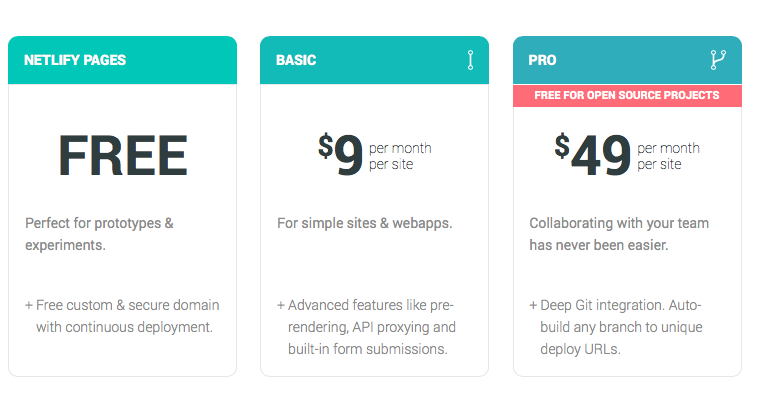
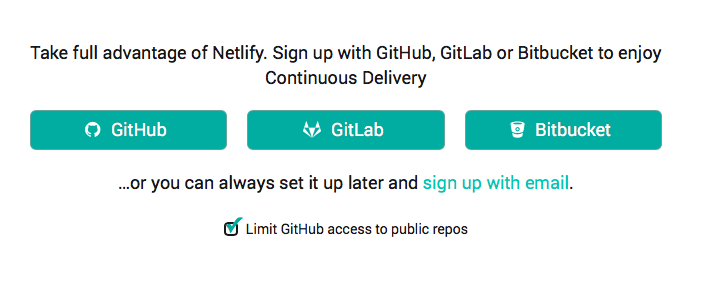
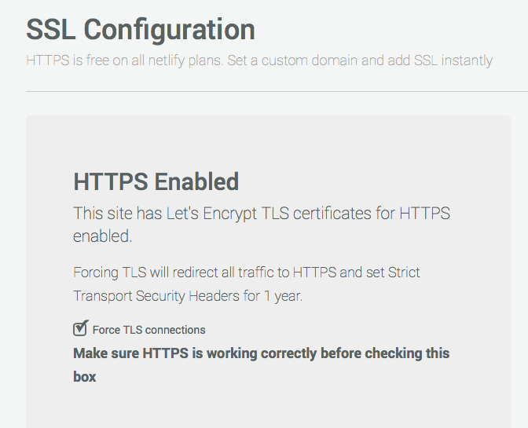
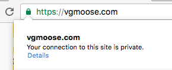

[Github Pages](https://pages.github.com) is an incredibly useful service that makes deploying a static website very free and very easy. I used Github for a long time to host this website ([discussed here](https://vgmoose.com/blog/implementing-a-static-blog-search-clientside-in-js-6629164446/)) and others. Since the websites are purely static content, there isn't much to maintain besides the actual html/css/js files that are pushed to the Github repo. There are two very cool features provided by the service. One, free TLS encryption is automatically provided to to those that use its service, simply by changing the http:// to an https:// in the URL. Another is the ability to use a custom domain by providing a CNAME file in the respository. While being able to do these two things for free is incredibly useful, a notable shortcoming is that you cannot use both *at the same time*.

The [feature has been highly requested](https://github.com/isaacs/github/issues/156) by Github Pages users for quite some time. It's a complicated area as an SSL certificate is tied to the domain name, Github would be entering into the territory of becoming a [Certificate Authority](https://github.com/isaacs/github/issues/156#issuecomment-46923874), unless it did some workarounds. And even with those workarounds, an automated management of SSL certificates across a CDN could still get complicated.

[Netlify](https://www.netlify.com/blog/2016/01/15/free-ssl-on-custom-domains) offers completely free SSL with custom domains, issued by [Let's Encrypt](https://letsencrypt.org) through a service called Netlify Pages. Looking over the blog post (and the name of the service), it seems to be directly aimed at solving the problem where Github Pages falls short. 

Now, this isn't the compromise solution of Client -> SSL -> CloudFlare -> ClearText/Unverified SSL -> Github, it's a complete Client -> SSL -> Netlify with a real SSL certificate. And it's free!.. or so it says. There is an element of trust that still applies here, but without having to enter any credit card information or anything to sign up, I am given quite a bit of confidence in the quality of their service.

Switching to Netlify also was made very easy by their sign up process:

The projects can be imported directly to Github, by logging in with your Github account. It requires only public information for permissions, and after choosing the project to deploy, telling Netlify your domain name, and updating the your custom domain's DNS servers to [point to Netlify](https://www.netlify.com/docs/custom-domains), everything is ready to be moved (and the CNAME file can safely be deleted from your Github repo). 

And as an added bonus, it will even stay in sync with every push you make to your "Github pages" project, so the old workflow doesn't have to change at all.

Heading over to the HTTPS tab allows a full SSL certificate for your domain to be requested via Let's Encrypt with one click. It will automatically setup this certificate and then allow your site to be visited at both http:// and https:// addresses.

It also provides an option to force the http:// connections to go to https://, which is incredibly useful. I had to make a few small changes to some of my repos to make them compatible over the https protocol, but that was mostly my fault.

In a world where [Google gives a boost to SSL sites](http://searchengineland.com/google-starts-giving-ranking-boost-secure-httpsssl-sites-199446), and security is more important than ever, I was always upset that my simple website hosted on Github with a custom domain couldn't benefit from such modern technologies. Now, however, my problem looks to be completely solved! I get to have my cake and eat it too.

It's only been one day, but so far I am thoroughly impressed by Netlify's service. I mean this geniunely, even though re-reading this post a lot of it kinda sounds like an ad. Hopefully I don't come across any hidden "jk you do have to pay" in a week or so. Although, even if I did, switching back to Github Pages would be relatively easy. I'm also thrilled that I didn't have to compromise with the half-https approach with a CloudFlare-Github link.

In all honesty, my little blogging site doesn't absolutely need to be delivered over HTTPS, but it's exciting to finally join the ranks of the green lock!