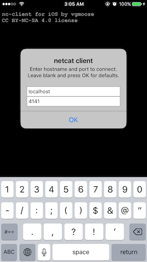

On December 15 2016, Ian Beer [posted a kernel exploit](https://bugs.chromium.org/p/project-zero/issues/detail?id=965#c2) for iOS <= 10.1.1. The code exploits the OS and provides access to a root shell on port 4141.

That's awesome! Upon seeing this, I updated from a full jailbreak 8.1 to 10.1.1, anticipating someone in the near future will tidy it up. Until then though, building the project at the link above and poking around the filesystem as root is interesting. 

Something that I missed from my jailbreak was being able to access terminal on the go. In theory, if I could only run netcat I'd be able to have full access to that root shell on localhost:4141. Sampling some of the [telnet apps](https://fnd.io/#/us/search?mediaType=ios&term=telnet) on Apple's app store left me very unimpressed. There didn't seem to be any free telnet client that would do exactly what I wanted it to do. This is probably the sort of thing that happens when you prevent users from installing "unauthorized" apps, and then charge a $100 subscriptions fee for developers...

So it's pretty ironic! Netcat isn't even a complicated program, but I clouldn't find anything that did simply what I wanted it to do. (Problem with most telnet clients was they don't allow you to enter binary mode, and without it you can't send "\n", only "\r\n", which hardly ever matters but it did for the shell). Contrast this with Android, which has [a bazillion teminal emulators](https://play.google.com/store/search?q=terminal&c=apps&hl=en), all of which can run netcat or telnet pefectly fine.

Well I don't have an Apple developer account (yet!) but I took it upon myself try to address this. I created an app I'm calling [nc-client (github link)](https://github.com/vgmoose/nc-client), which allows one to send and receive data over TCP with a server. The name's a bit misleading since it only does a subset of what nc can actually do.

  

The app is very barebones, but in the end it does what I want it to do. I'm able to, fully untethered from computer, launch the mach_portal exploit, and then connect with nc-client. Although the kernel exploit still fails some of the time, it's better than having no access on device.

Even if a full, Cydia-providing jailbreak is released tomorrow, I hope my little netcat app can make it on the app store one day. And working with Swift 3 is never bad experience to play around with. 
