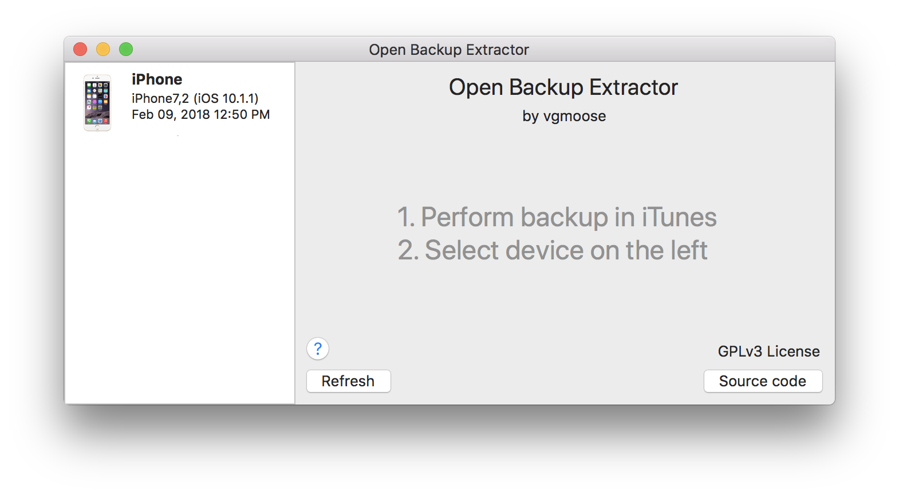
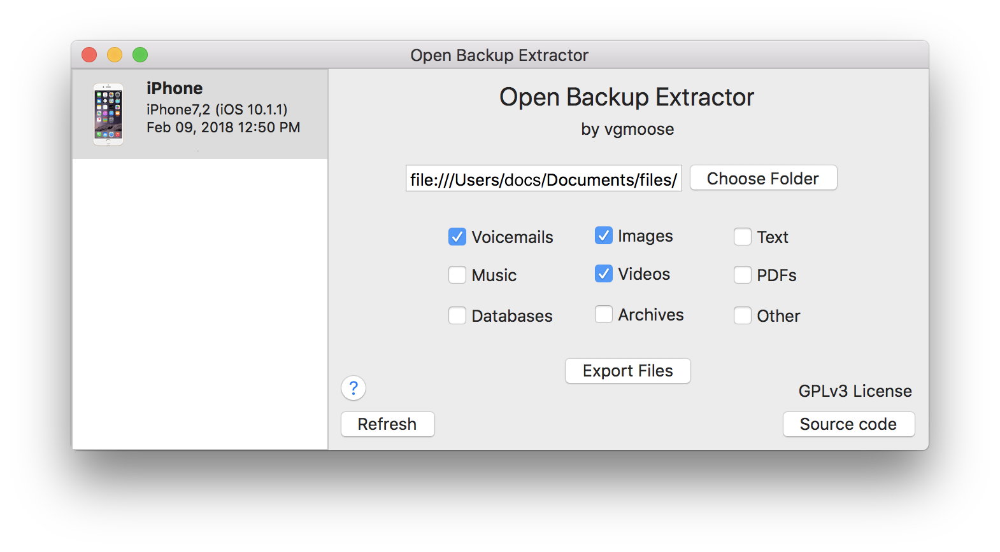

Recently, I got into the situation of needing to extract some old voicemails from an iTunes backup. iTunes does keep track of a lot of old voicemails but it doesn't provide a way to browse these documents.

And then I felt like I entered a parallel universe-- I couldn't find any programs that would allow be to simply extract all the voicemails from an iTunes backup that were completely free! 

This is especially irritating, as some programs would bring you to what appeared to be the final export screen, and then prompt for a credit card for a few bucks to use the program. I'm sure the average person who's trying to use such a tool has an urgent need to get the information (such as an important business call, time-sensitive information, or even loss of a loved one) so dangling the export utility in front of them appears to really be trying to feed off their desperation.

After looking into it, the iTunes backups are just folders that contain the different types of files. It's possible to extract this data only by going through the files and pulling out files that are of the desired type.

It's not a pretty tool, and the method I use to check for file types is a little slow, but it does get the job done and allow you to export any voicemails, images, and other types of documents.

OpenBackupTool is available for [download here](https://github.com/vgmoose/OpenBackupExtractor/releases), and is open source so I would welcome any enhancements that anybody can think of / offer. I stopped working on this once I was able to get the files out of the backup that I was looking for, but it would be nice to see a community led effort to try to lower the bar for people that are in need of listening to old voicemails or recovering documents that may lay hidden in an iPhone backup.

Screen shots below:

