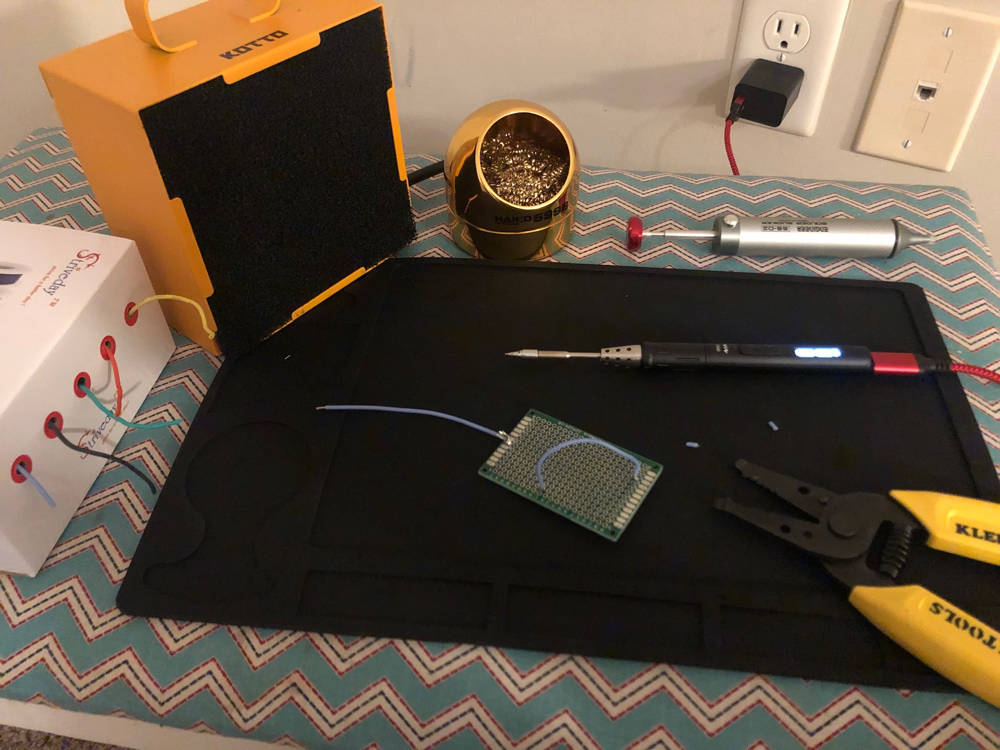

Hello! Like USUAL it feels like it's been forever since drafting a blog post. Apparently I felt like there was no point to post at all in all of 2019.

Actually, I can probably scrounge up a Homebrew App Store release post that happened in 2019 and repurpose that as a blog post... Like most of the other older blog posts on here.

So anyway, the year is apparently 2020 somehow, and there's a Literal Death Virus outdoors that turns all of reality into a poorly thought out NaNoWriMo premise. And we're here! I'm here. You're here, presumably.

Let's just run down a couple new things:

## A New Computer
Something that I learned the hard way when spending all day indoors locked up and typing on your computer, is that the Macbook Mid-2017 keyboard has big time keyboard problems. In 2015, I [kinda bragged](https://vgmoose.com/blog/my-daily-computer-7871405254/) about how I was able to squeeze so much mileage out of my old 2009 Macbook. That unfortunately is not the case for the 2017 one.

Apple announced a 2020 Macbook and I'm ashamed to say that one of my primary motives for purchasing it is their "new" "magic" keyboard. The spec, storage, and memory boosts are all nice too, but literally the keyboard is the essential thing I'm focused on. The old "Butterfly keys" are gone now. Over the last two months, despite the usual jamming problems with the 2017 keyboard, about 5 of my key caps (E, T, I, O, and R is looking loose) are either barely clipped on still or have already fallen off.

To make matters even worse, my work laptop is a 2018 MacBook Pro, and I _also_ have been having keyboard problems with it! Some people are telling me I'm an overly aggressive typist, but my old 2009 Macbook was able to handle it.

Anyway, as of yesterday, that all may be behind me. The 2020 Macbook Pro keyboard feels _exactly_ how I remember the 2009 keyboard feeling. And that's a good thing.

Since I opened up the older blog post, I'll make a table here with the specs, comparing the three models I've had in the last DECADE:

|Spec|2009|2017|2020|
|----|----|----|----|
|Screen|1280x800|2560x1600|2560x1600|
|Processor|2.26 GHz Intel Core 2 Duo|3.1GHz Dual-Core 7th gen i5|2 GHz Quad-Core 10th gen i5|
|Memory|8 GB DDR3|16 GB DDR3|16 GB DDR4|
|Storage|250GB + 750GB HDD|512 GB|1 TB|
|"Magic" Keyboard|Yes|No|Yes|
|Fingerprint|No|Yes|Yes|

Sadly, the upgrade isn't super-significant. The boosted specs are welcome, but the keyboard is king apparently. Fortunately, My 2017 still has some re-sell value, so it isn't a total loss here. Also an interesting observation is that my storage needs have seemed to stay mostly static over the years.

It will be sad to see the old "new" computer go so soon, but even if the keyboard were repaired, I don't feel like I could rely on it for an extended period of time.

## Projects I'm Working On
For some reason, I thought that this period of forced quarantine would be a good time to get work done. This attitude may not have been that uncommon according to [this Onion article](https://local.theonion.com/man-not-sure-why-he-thought-most-psychologically-taxing-1843004933). The weeks are flying by. I wasn't a very active, outdoorsy person to begin with, but this level of indoors-ness is making it pretty hard to put on a smiling face when joining video chats.

That being said, I might as well go and rundown some stuff that I still have up in the air:

### Homebrew App Store for 3DS and Wii
Yes, somehow in the year 2020, I am working with the other members of [4TU](https://fortheusers.org) to bring hb-appstore to the 3DS and the Wii. When finished, this would make the App Store available on 4 different Nintendo'd homebrew devices.

The code is already merged to master on [Gitlab](http://gitlab.com/4tu/hb-appstore), but there are a few more changes to make to networking and layout, (and also separate repos need to be maintained) before that's done.

ForTheUsers also now officially has an [OpenCollective page](https://opencollective.com/fortheusers), which is like Patreon but for FOSS projects. I really enjoy being a part of a FOSS-centric group like this. I also have a lot more thoughts on this exact subject (crowd-funding, FOSS projects, homebrew communities) which would make for a good separate blog post.

### Glass Controller
I've been working on getting [this program](git@github.com:vgmoose/GlassController.git) into a state where it's useable for the average macOS user. It's evolved throughout the years, and I've been sitting on the latest iteration of it for a while.

I'm going to make another blog post on this tool's history, and the pre-release version, is going to be available [here](https://vgmoose.com/1730555559/). I have the draft up in another tab, so the forward-linking like this should work.

### vgedit
Besides Space Game and Homebrew App Store, [vgedit](https://github.com/vgmoose/vgedit) is my Other homebrew app that I've been working on. It uses the [Chesto](http://gitlab.com/4tu/chesto) library, like hb-appstore. It's been neglected in the ~1 year since it came out, and I'm back to working on it and trying to get it to be able to handle larger files.

With any luck, in a few days I'll be able to make a blog post on it being updated as well!

### pypokescript
I guess I can't just go down my Github and call out all the half-finished project, but I should call attention to [pytpokescript](https://github.com/vgmoose/pypokescript), which is poised to eventually be a graphical editor for Pokemon games / roms.

Right now, it can open a B2W2 pokemon rom (without needing any other tools), and scripts can be edited via the CLI. This is something that I've wanted to do for a long time but hadn't really had the skillset to do so until recently. That being said, the skillset likely wasn't all there, as I haven't worked on it in about 2 years.

It's on my list of things to circle back to though! I want a cross-platform Pokemon ROM editor like the good ole 3rd gen hacking days!

### Getting into Hardware
After binging too many videos on GBA modding, I went through and got a TS80 soldering iron and a bunch of boards to practice on / start small electrical projects. I don't really have an end goal with endeavor except to upgrade my skills in this area.

It would be nice to somehow merge some of these efforts with my [GBA assembly experiments](https://github.com/vgmoose/gba_asm), which would also likely make another great blog post. It occurs to me now that this entire post is kinda being used as an index for myself to use when I feel like I have nothing to say or write about.

I'd like to make something like the [PiBoy SP](https://granthaack.com/piboy-sp/), but have it look innocuous as possible that it's a regular GBA, in terms of being able to play GBA cartridges / homebrew games.

## What else?
That's really all I have for now. I had to dig up this blog cause I barely remembered how to update it. As such, the blog.py generation script has been updated to python3, which is what you gotta use nowadays if you want any cred amongst other python devs.

The earliest blog post on this site is from [2005](https://vgmoose.com/0661862430), and it came off a small website that I made for the other kids in my neighborhood when I was growing up. It was the first (and only...) issue of a quarterly online magazine (which was also available in a Powerpoint format). Comparing it later blog posts is really strange. I don't exactly know how I feel about it... 15 years is a long time!

Believe it or not, I'm trying to give this impromptu blog post a thread of organization, and this paragraph is my stunning conclusion. New computer, new year, mild quaratine setbacks, but hopefully I can put a satisfying "end" to the projects outlined here.

It's really easy to fall into the habit of keeping working on something until it's "ready". Something I've realized however, though, is that projects will always need to keep evolving and scope will keep creeping. I'd like to be better about goals like this and actual usable-but-maybe-not-perfect projects in the future.

Some stuff I'd like to get into in the coming years: more game design and 3D modeling, so that I can work on projects that appeal to more people, instead of more niche communities on the Internet.

Until next time.