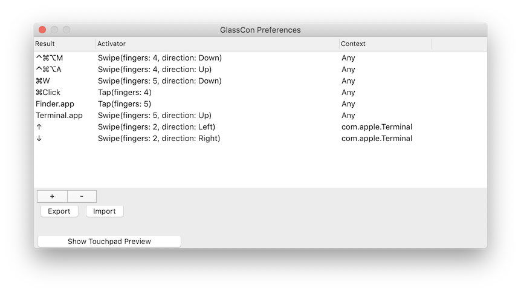
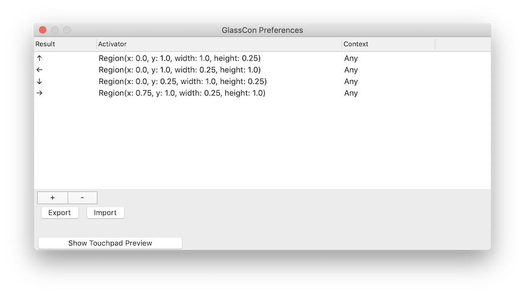

Here's a pre-release of a tool I've been working on for a while, which I'm now calling Glass Controller. It's macOS tool for setting up gestures and other shortcuts to be activated with the Macbook touchpad.

It's available for [download here](https://github.com/vgmoose/GlassController/releases), and it looks like this:

More information on what this tool can do is available in the [readme](https://github.com/vgmoose/GlassController), and it's available under the GPLv3 license.

At this time, I'm calling this a pre-release, as the GUI to configure the gestures/shortcuts is not fully realized or useable. I've been sitting on the code for a while though and using it for my personal use, so I figure for the right audience it might stil be useful.

Or if anyone out there wants to help, PRs and issues are open to work on a user interface that makes sense. Right now, the tool can only be configured by manually editing a JSON file with the Result+Activator+Context combo that you want. Ideally there would be menus / key listeners that allow the user to do this without ever touching a file directly.

## Usage
Profiles can be imported via the UI. Profiles are JSON files, for some pre-built ones, see the [`examples`](https://github.com/vgmoose/GlassController/tree/master/examples) directory. In the future, the UI should allow the creation of the various types of Actions. For a list of macOS keycodes, see [here](https://stackoverflow.com/a/16125341).

An action is a marriage of three components: Result, Activator, and Context. There are different types within each component, and each type can take different arguments to configure it. For JSON syntax, see [`examples`](https://github.com/vgmoose/GlassController/tree/master/examples) directory.

### Result
A **Result** is the output of whatever Activator+Context occurs. This can be one of three things:
- KeyBinding: Press a given key, while holding zero or more modifier keys (like Cmd)
- LaunchApp: Start an app given the full path to the .app file
- MouseClick: Perform a mouse click with the given mouse button, while holding modifiers, at the current coordinates

### Activator
Activators are inputs that occur on the Touchpad that must occur in order for the given Result to fire.

There are three types of Activators:
- Swipe: Moving in a direction (up/down/left/right) past a certain treshold with a given number of fingers
- Tap: Pressing briefly for a given number of fingers
- Region: Having any number of fingers over a region defined by a given x/y, width/height percentile coordinates

### Context
A Context is something external to the touchpad state that should be met for the touchpad Activator to qualify

Currently there's one Context:
- AppBundle: Only listen when an app with the given bundle ID is in the foreground

## Purpose and Reasoning
I'm a bit of a peculiar person, and for whatever reason, I really really don't like touching the arrow keys on my computer. I'm saying this not from a place of well reasoned logic, but more from a place of "I probably have a problem". It's one of those things where if I push in one direction, I like to push in the other direction, and I kinda lose my mind over trying to "balance" it out if I need to hold them for a really long time.

Sadly, this is kinda thing that completely impedes playing a game that uses arrow keys. I can handle control sticks or d-pads just fine, just specifically the keys on a computer I don't like to press or hold like this. For that matter, I don't like to hold _any_ computer keys, and the arrow keys especially so.

With that context, this tool is almost more of an Accessibility thing for myself rather than a workflow-enhancer.

### Version 1 (Fingerpad)
I began work on what would eventually become this tool about 7 years ago, which I called [Fingerpad](https://github.com/vgmoose/fingerpad). You can see it in action [here](https://www.youtube.com/watch?v=4flLrTUxZrw).

The goal of the tool was to allow me to move without touching the arrow keys at all. I could instead use the mouse and the touchpad like an ad-hoc joystick and simply mouse around, and have these movements translated to arrow keys, and finally move my player.

This is especially useful when recording Pokémon gameplay, and some of the later videos on my YouTube channel (rip) were done using this method.

The original Fingerpad was written in C++ with QT, and was purely mouse based, but could be "overlayed" over the content that you were using (as seen in the video above).

### Version 2 (Fpad2)
Fast forward a few years, to 2015, I made something called ["Fpad2"](https://github.com/vgmoose/fpad2), which I probably called it to get away from the definitely-bad-name of "Fingerpad".

This was written in Objective-C, and accomplished almost the exact same goals as the original but with a cleaner codebase, and better method of invoking the keys. Like like time, you were meant to draw the window over the content you wanted to control, activate it, and then use your mouse to move the character around.

I actually used this tool for quite a long time, whenever I needed to control something with arrow keys and didn't have a controller to use. The readme reads a little saltier than I had probably intended.

### Version 3 (Glass Controller)
Finally, in 2018, I re-rewrote this project, this time from the ground up in Swift. I wanted to address the issue that using the mouse was not convenient to move the character around for a number of reasons.

Ideally, and as was my desire from the start, I should be able to move the character by putting a finger on certain regions of the touchpad. This would work in a similar manner to Phone controls that use on screen buttons.

To solve this, it would use a similar layout to my last two "versions" of the tool, but using the actual touch position _on the touchpad itself_ rather than moving the mouse over a region. Doing it like this means that I don't have to worry about positioning over a game either, just enable the app from the menu bar and I can start moving my finger to the appropriate region.

The above setup uses the "Region" activator to define four regions of the touchpad, one for each arrow key direction. This is byfar the best setup I've had for a touchpad-based arrow-key alternative! The above JSON config is [available here](https://github.com/vgmoose/GlassController/blob/master/examples/GlassConPrefs_Fingerpad.json).

Over the last year I've had a little bit of time to work on enhancing it to have other features that people would actually want to use, beyond just a Region activator and KeyBinding result, which inspired the Gesture and Tap activators, and the LaunchApp and MouseClick results.

I've slowly replaced a few other tools that I used to use with this one now, and having used it for a few months, wanted to put it out there for other people to try, or to help work on.

## Future Goals
- Actual macOS application rather than a command line tool (might hit an issue with sandboxing)
- Allow gestures to be configured from the GUI rather than only via JSON
- Present as a virtual controller for better support in some emulators, to do more Results than just key presses (eg. button presses via Touchpad)

Thanks for reading this post, I recognize this is a very niche tool, but if there's anyone out there who has a similar Accessibility-ish problem like I have with the arrow keys, here's a very specific app that can help you!