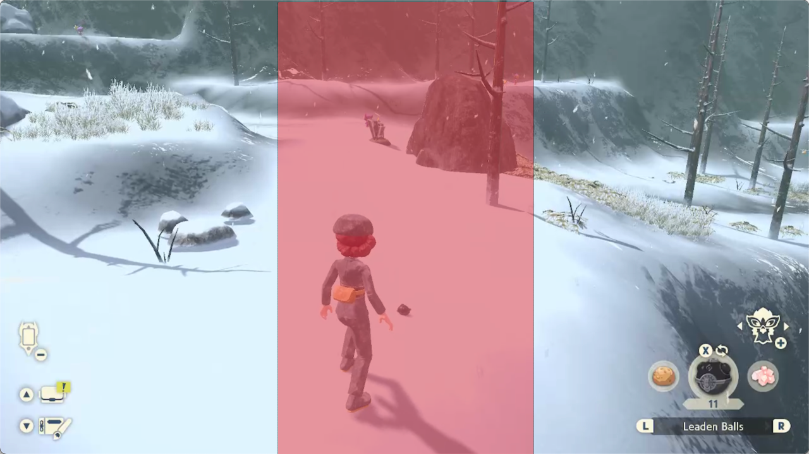
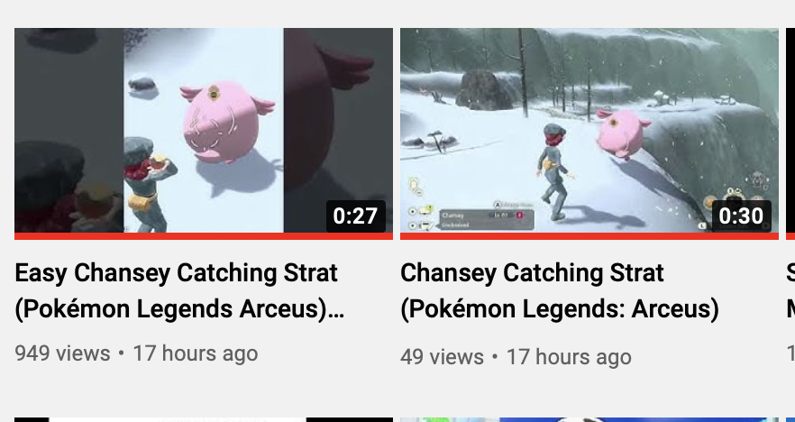

It's another new year! Still feels like 2020! Noooo!!

In this post, I will be showing some `ffmpeg` commands that can be used to convert 720p or 1080p 16:9 video into a 9:16 format that will allow it to work in YouTube Shorts. I'm a long time Youtuber, but I'm also someone who thought up until yesterday that "TikTok" had a space between Tik and Tok. That'd be like writing "You Tube"! Jeez.

But with YouTube Shorts, I've been understanding more the appeal of quick and dismissable videos. It's much more of a "feed" where videos come to you for judgement, to be viewed or scrolled past, rather than selected or competing for your attention with clickbait. Then again, the alternative is now the algorithm is in even more control of what you see, and it's even more short-attention focused... Uh, anyway.

Let's say your source video file is `input.mp4`, and has the dimensions of `1280x720` (width x height). This is the default resolution for the Nintendo Switch 30 second gameplay recordings.

The below command will turn it into a 720x1280 video named `output.mp4`, cropping out from the center:

```
ffmpeg -i input.mp4 -vf "crop=405:720:437:0,scale=720:1280" output.mp4
```

It will turn a fullscreen source video [like this](https://www.youtube.com/watch?v=iPUCb-0gd8E) into a vertical one [like this](https://www.youtube.com/watch?v=EAY7-8dcjBs).

There are two main arguments of interest in the command, and those are crop and scale. For crop:
```
crop=405:720:437:0
crop=crop_width:crop_height:origin_x:origin_y
```

In this case, my source video was 1280x720. I want to keep the height the same (720), but change the width for 9:16 format. This means multiplying `720*(9/16) = 405`. So crop_width is 405, crop_height is 720.

Then for the origin offsets, origin_x is set to allow a width of 405 to be centered within the original 1280 canvas. This requires `orig_width/2 - crop_width/2`, or `1280/2 - 405/2 = 437.5`, or 437. origin_y is 0 as we are going to keep the full height.

The red area in the below photo is the centered 405x720 region within the source 1280x720 video:


The result of the crop operation is going to be a 405x720 video. But wait, we want 720x1280! Well, this is as high quality as this type of crop is going to be, but we can upscale the video. I did this step as I read online that 600x600 are the minimum bounds for a YT short.

The scale arguments:
```
scale=720:1280
scale=new_width:new_height
```

So this will then scale the result of the crop into the desired resolution. Then, to upload this video to YouTube, include `#Shorts` in the title or description, as of this time of writing.

You can modify the crop and scale commands here to make square or other dimensions of videos as well. ffmpeg can also do more things, like [merging two videos into one](https://stackoverflow.com/a/42257415), or [applying blur effects](https://stackoverflow.com/a/58710803). These will usually use complex-filter argument however, and need to be used instead of the above crops (replacing them with complex-filter syntax) or chaining the output of the above crops into the new merges/blurs.

For simply turning recorded gameplay into a vertical format however, using only the crop and scale filter commands detailed on this page get you a lot of mileage out of not a lot of tinkering.

The above video was my first 9:16 video. You can confirm it did actually become a "Short" by opening your YT channel in the iOS or Android app and viewing it.



As seen here, the Shorts-style video gets out to a lot more people a lot quicker than the landscape style video is able to. This "kind of" can help level the playing field for small creators to get their content discovered quicker.

For the traffic for the video on the left, >90% of views came from "Shorts feed", which is another indication that the vertical video is being considered a short.

Final convenience note: In the above, given a `1280x720` source video, a `405x720` vertical one was cropped out of it. If the video were instead `1920x1080`, the equivalent crop would be `607x1080`. Likewise, for a `2560x1440` source, the 9:16 crop wouold be `810x1440`. These are calculated by multiplying the source height by `(9/16)`.