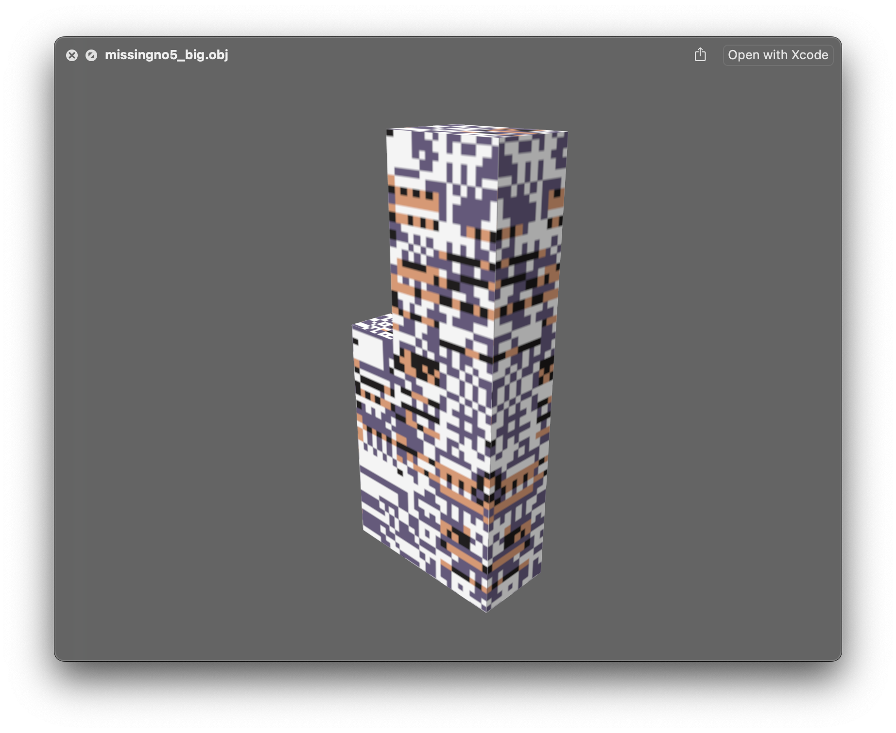

In 2016, I made [a video](https://www.youtube.com/watch?v=7eVWhewLnEY) where I modded a Missingno model and short event into Omega Ruby. This was actually _itself_ a much-later sequel to a [2007 video](https://www.youtube.com/watch?v=xvVCTKdhOZk) where I did something similar in the original Ruby version!

This is both a post to reflect on that, but also to upload those models that I made back then. They can be downloaded here: [missingno_model_files.zip](./missingno_model_files.zip).

From what I remember, for 3DS modding, each face in the OBJ file cannot have more than 3 vertices (triangular faces only). Maybe it's chnaged since then, but that was a constraint that I remember having to manually edit and fix. The [OBJ text file format](https://en.wikipedia.org/wiki/Wavefront_.obj_file) is also not too bad to work with directly in a text editor.

Here's the 2016 video where this model was used:

<iframe width="560" height="315" src="https://www.youtube.com/embed/7eVWhewLnEY" title="YouTube video player" frameborder="0" allow="accelerometer; autoplay; clipboard-write; encrypted-media; gyroscope; picture-in-picture; web-share" referrerpolicy="strict-origin-when-cross-origin" allowfullscreen></iframe>

I love all the extended lore around Missingno, and although I had always wanted it to be officially acknowledged by Nintendo in later games, living on in fan creations is pretty great too!

Actually, somehow the ORAS video got enough views that it did a circuit on gaming sites, and I was [interviewed on the topic of Missingno by Kotaku](https://kotaku.com/someone-hacked-missingno-into-a-modern-pokemon-game-1788292004). I think the "why" of how a decades old easter egg and glitch attracts fan attention is super interesting.

And here's the older 2007 video with the Missingno Event as well, just for completeness:

<iframe width="560" height="315" src="https://www.youtube.com/embed/xvVCTKdhOZk?si=kNdmfaBurp5WgOA6" title="YouTube video player" frameborder="0" allow="accelerometer; autoplay; clipboard-write; encrypted-media; gyroscope; picture-in-picture; web-share" referrerpolicy="strict-origin-when-cross-origin" allowfullscreen></iframe>

Am I someone that every 8 or so years makes a Missingno video? Maybe!

That's it! Tune in next time?