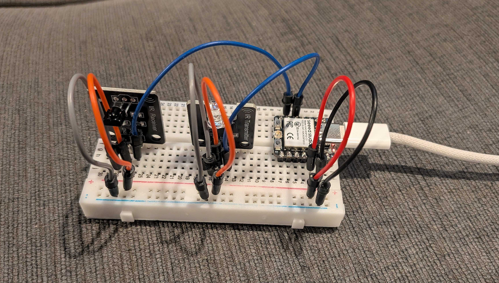

Quick blog post to share IR NEC codes for [UGREEN 8k HDMI 2.1 Switch](https://www.amazon.com/dp/B0GL7Q8FLX)! The remote on this model has four buttons, one for each input, and then a cycle/next button:

| Remote Button | NEC Code |
| ----- | ----- |
| Input 1 | `1FE40BF` |
| Input 2 | `1FE20DF` |
| Input 3 | `1FE609F` |
| Next Input | `1FE10EF` |

Hopefully this info is useful to someone else. Here's an image of the breadboard layout that I used to capture and send them:

And the specific model interesting parts pictured above are:
- [Seeed Studio XIAO ESP32C3](https://www.amazon.com/dp/B0DRNSV5CS)
- [38khz Ir Receiver Sensor Module + Ir Transmitter Sensor](https://www.amazon.com/dp/B0DSVZ7NNC)

If I were a savvier blogger, I'd have Amazon affiliate links up there instead... Well, it's too late now!

Also the library used is: [github.com/crankyoldgit/IRremoteESP8266](https://github.com/crankyoldgit/IRremoteESP8266)